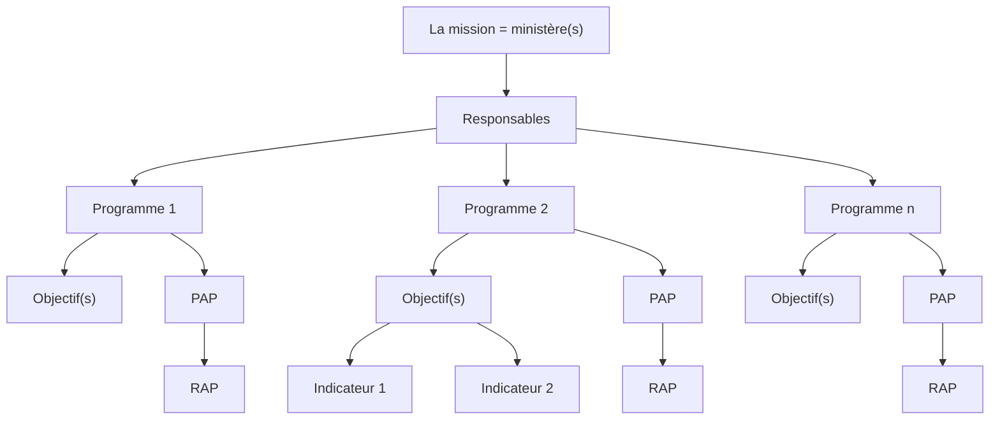

# Budget classification under LOB2019

## Circulaire

### *Article 1:* Expenses classification

* نفقات التأجير
* نفقات التسيير
* نفقات التدخلات
* نفقات الاستثمار
* نفقات العمليات المالية
* نفقات التمويل
* النفقات الطارئة وغير الموزعة

### *Article 2:* Allocation

## Organization

### *Articles 4 - 5*: Code

$$
\overbrace{*}^{\text{Code du programme}} \underbrace{*}_{\text{Code du sous-programme}} \overbrace{***}^{\text{Code de l'article}}
$$

e.g.

!!! bug
    un meilleur exemple

$$
\overbrace{9}^{\text{Code du programme}} \underbrace{1}_{\text{Code du sous-programme}} \overbrace{100}^{\text{Code de l'article}}
$$

* $9$ est le code du programme.
* $8$ est le code du sous-programme.
* $100$ est le code de l'article "المنح المخولة للسلط العمومية"

### Glossaire

* **RDP**
:   Responsable de programme
* **PAP:**
:   Projet Annuel de Performance: un engagement sur les résultats
* **RAP:**
:   Rapport Annuel de Performance: un compte rendu des résultats
