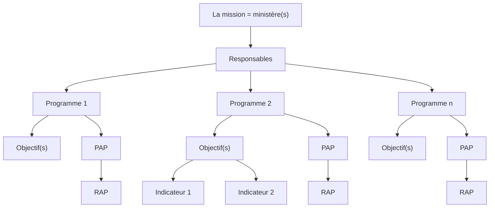

# Nomenclature budgétaire à partir de la LF 2020

## Dépenses

!!! warning "Nomenclature en Français"
    La nomenclature en Français n'est pas détailiée dans le criculaire, pour la consulter visitez le [lien suivant](https://bit.ly/2kSoOOO)

| Partie (AR)                  | Partie (FR)                         |
|------------------------------|-------------------------------------|
| نفقات التأجير                | Dépenses de rémunérations           |
| نفقات التسيير                | Dépenses de moyens de services      |
| نفقات التدخلات                | Dépenses d'interventions            |
| نفقات الاستثمار               | Dépenses d'investissements          |
| نفقات العمليات المالية       | Dépenses des opérations financières |
| نفقات التمويل                | Les charges de financement          |
| النفقات الطارئة وغير الموزعة | Dépenses imprévus et non réparties  |
  
## Organization



$$
\overbrace{*}^{\text{Code du programme}} \underbrace{*}_{\text{Code du sous-programme}} \overbrace{***}^{\text{Code de l'article}}
$$

e.g.

!!! bug
    un meilleur exemple

$$
\overbrace{9}^{\text{Code du programme}} \underbrace{1}_{\text{Code du sous-programme}} \overbrace{100}^{\text{Code de l'article}}
$$

* $9$ est le code du programme.
* $8$ est le code du sous-programme.
* $100$ est le code de l'article "المنح المخولة للسلط العمومية"

## Recettes

!!! bug "La nomenclature des recettes"
    وتجدر الإشارة إلى أنه بهدف المحافظة على المعطى المتعلق بمصادر التمويل، فإنه تم تخصيص خانة في النظام المعلوماتي للتنصيص عليه كما يلي
    ```
        * موارد عامة للميزانية
        * قروض خارجية موظفة
        * حسابات خاصة فالخزينة
        * حساب أموال المشاركة
    ```

!!! bug "Nomenclature en FR n'est pas officielle"
    Source LOB, en attendant la traduction en FR

| (AR)                  | (FR)                  |
|-----------------------|-----------------------|
| المداخيل الجبائية     | Recettes fiscales     |
| المداخيل غير الجبائية | Recettes non fiscales |
| الهبات                | Dons                  |

## Glossaire

* **RDP**
:   Responsable de programme
* **PAP:**
:   Projet Annuel de Performance: un engagement sur les résultats
* **RAP:**
:   Rapport Annuel de Performance: un compte rendu des résultats
