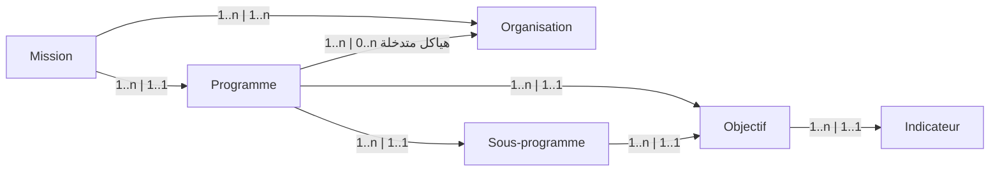

# ERD

## Liste d'entités

### GBO

* Organisation
* Mission
* Programme
* Sous-programme
* Objectif
* Indicateur
* Unité opérationelle

### Dépenses

[Lien](http://127.0.0.1:8000/Gestion_du_Budget_par_Objectif/budget_classification/#depenses)

## Relations

